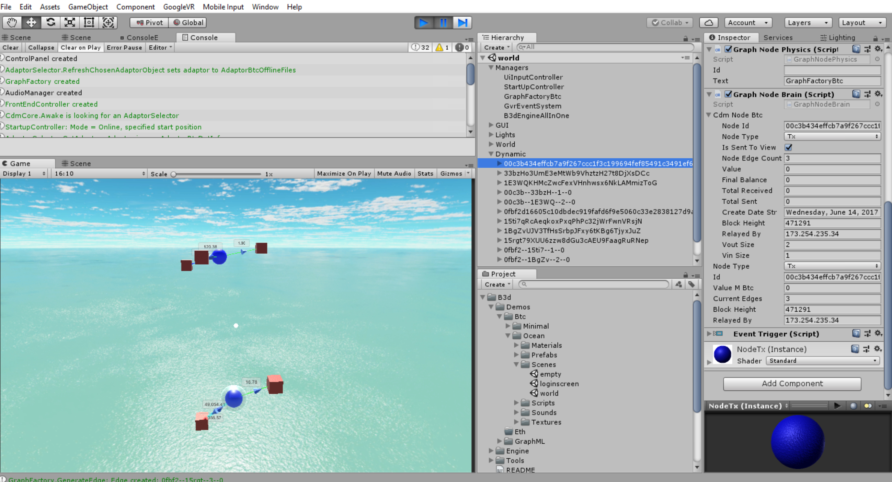
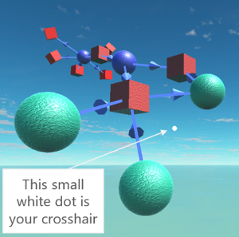

# Blockchain 3D: Open Source 3D and VR Blockchain Visualisations


[](https://github.com/KevinSmall/blockchain3d/issues) [](https://github.com/KevinSmall/blockchain3d/stargazers) [](https://github.com/KevinSmall/blockchain3d/blob/master/LICENSE) [](https://twitter.com/intent/tweet?text=Open-source%20blockchain%20data%20visualization%2C%20wow%21&url=https%3A%2F%2Fgithub.com%2FKevinSmall%2Fblockchain3d&hashtags=blockchain3d,bitcoin,ethereum,blockchain,visualization)

The complete open-source code and assets are available in this repository. If you just want to run the compiled application, visit [the download page here](http://blockchain3d.info/download/) for iOS, Android, Linux, MacOS and Windows.

# Contents
- [Introduction](#introduction)
- [Getting Started](#getting-started)
  - [Prerequisites](#prerequisites)
  - [Installation](#installation)
- [Usage](#usage)
  - [What You Can See](#what-you-can-see)
  - [How to Interact](#how-to-interact)
- [Making Changes](#making-changes)
- [Contributing](#contributing)
- [Credits](#credits)
- [License](#license)

# Introduction
Blockchain3D is an open-source multi-platform application to visualise graphs in glorious 3D and virtual reality (VR).  The application is built using Unity and C#.  The word **graph** here is used in its mathematical or computing science sense as being a collection of **nodes** connected by **edges**. This project is about [graph drawing](https://en.wikipedia.org/wiki/Graph_drawing) rather than [charting](https://en.wikipedia.org/wiki/Chart):


Blockchain3D is a generic graph drawing tool. Social media provides a good source of graph data: Twitter, Facebook and LinkedIn all contain graph relationships that could be visualised in Blockchain3D.

However, as the name suggests, the current focus of Blockchain3D is to visualise blockchains. Many aspects of blockchains can be represented by graphs. For example, consider Bitcoin. A Bitcoin transaction is a flow of unspent Bitcoin from a set of input addresses to a set of output addresses. This can be drawn as a graph in 3D space:


# Getting Started
## Prerequisites
[Install Unity](https://unity3d.com/get-unity/download). The project is currently developed with Unity 2018.1.0f2. Later Unity versions should work fine.

The project makes calls to [blockchain.info](https://blockchain.info) to get the necessary bitcoin data to display. If you intend making very many calls to the blockchain.info site, you will need to [apply to them for a free API key](https://www.blockchain.com/api) to bypass their request limiter. To run the demos and play around, you will not need an API key. In addition, a small amount of bitcoin test data is built in and so the project can also be run completely offline. 

## Installation
Download or clone [this repository](https://github.com/KevinSmall/blockchain3d). All of Blockchain3D is contained in the `B3d` folder. To help orientate yourself in the project, note these folders under the top level `\Assets\B3d\` folder:

```
Folder                  Contents
B3d
├───Demos               Demo scenes organised by graph family (Bitcoin, Ethereum etc) then scene
│   ├───Btc
│   │   ├───Minimal     Bare minumum required to retrieve Bitcoin graph data, with no graphics
│   │   └───Ocean       Main application with the pretty ocean view and floating 3D graph objects
│   ├───Eth             Not used yet
│   └───GraphML         Not used yet
|
├───Engine              
│   ├───Adaptors        Adaptors that read source data, formats it to common format
│   ├───Cdm             Common Data Model that stores the common format adaptor data
│   ├───FrontEnd        Frontend part that reads Cdm data and presents it to a frontend
│   └───Prefabs         This folder contains B3dEngineAllInOne.prefab, the main engine
|
└───Tools               Various tools available across all demos and engine
```
The C# scripts have namespaces matching the above folder structure.

# Usage
Take a look at the scenes in the folder `\Assets\B3d\Demos\Btc\Ocean\Scenes`. Open the scene called `world`. Play the scene in the editor. You will see some graph objects appear something like this:



## What You Can See
Blue spheres are bitcoin transactions. Red cubes are bitcoin addresses. The cubes and spheres are **nodes** in graph terminology. You can see lines with arrows joining the nodes. These lines are called **edges** in graph terminology. The arrow direction shows the flow of bitcoin. The billboarded text labels near the edges show the flow of bitcoin measured in milli-bitcoin.

A bitcoin transaction is nothing more than a flow of bitcoin *from* one or more addresses (the inputs) *to* one or more addresses (the outputs). An address can be both an input *and* an output for a transaction (the address is said to be "receiving change"). In this case the arrow on the edge connecting the nodes will be bi-directional.

## Sources of Data
When run directly, the `world` scene defaults to being online showing some specific bitcoin transaction data sourced from blockchain.info. The `world` scene can also be run via the `loginscreen` scene. 

To do this, open the `loginscreen` scene in the same folder and run it. From here you can specify a start address or transaction, and you can choose to run offline using demo data only. When run with demo data, the application does not need internet access and it won't try to get data that is outside the test data set.

## How to Interact
If the build target is Windows/Mac/Linux then it is possible to look and fly around in the game window in the editor using mouse and WASD keys (and QE for up down).  If the build target is Android then the controls are different because the Unity editor tries to emulate VR mode (press shift or alt and use mouse to do VR-like head movements).

On all platforms, the little white dot in the centre of the screen is your crosshair:



The crosshair shows what you are looking at. A node turns white when it is gazed at, and the crosshair will expand into a circle if you can interact with that item.

Move the crosshair (the little white dot) until it is over the address or transaction you want to know more about. The item will turn white, and the crosshair dot will expand into a circle if the item can be interacted with. Then click or tap to see more edges associated with that node.

Some addresses have many thousands of transactions and some transactions involve many hundreds of addresses. Instead of trying to display all of these edges at once, the application starts by showing only the first few edges. Then you can display more edges by gazing at the address or transaction and tapping the screen or clicking the mouse

You can see a complete list of usage controls [here](https://blockchain3d.info/how-to-use/#keyboard-controls).

# Making Changes
See the [developer wiki](https://github.com/KevinSmall/blockchain3d/wiki) for complete documentation on:
* How the engine works.
* How to use it in your own applications.
* How to make changes to the engine.

# Contributing
Contributions are very welcome! Please see [CONTRIBUTING.md](./CONTRIBUTING.md). An approximate roadmap is available [here](https://blockchain3d.info/roadmap/). 

# Credits
* SimpleJSON code is by [Markus Göbel](https://github.com/Bunny83/SimpleJSON).
* Some Force Directed Graph code is inspired by work from [Bamfax](https://github.com/Bamfax/ForceDirectedNodeGraph3DUnity).
* Some camera control code came from [Jason Graves](http://www.collaboradev.com). 
* The wonderful skybox in the Ocean sample (prominent in most every application screenshot) was kindly provided by the most excellent people at [70-30.de](http://70-30.de/).

# License
All content licensed under [GNU GPL v3](./LICENSE) apart from:
* SimpleJSON code licensed under [MIT](https://choosealicense.com/licenses/mit/).
* Sky box asset in the Ocean demo licensed under [CC-SA-4](https://choosealicense.com/licenses/cc-by-sa-4.0/).
* GoogleVR licensed under the [Apache License v2](http://www.apache.org/licenses/LICENSE-2.0).

