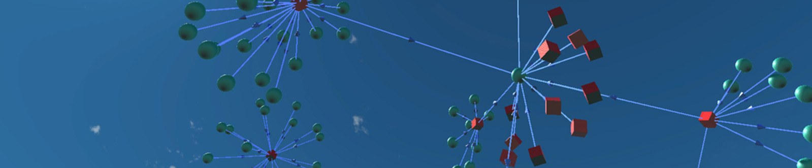
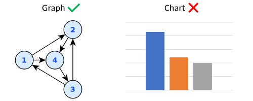
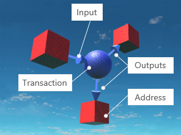

# Blockchain 3D: Open Source 3D and VR Analysis of Blockchains

   

The complete open-source code and assets will be here in Q3 2018 (aiming for August). For now, you can [try out the closed-source version](http://blockchain3d.info/download/) available for iOS, Android, Linux, MacOS and Windows.

# Introduction
Blockchain3D is an open-source multi-platform application to visualise graphs in glorious 3D and virtual reality (VR).  The application is built using Unity and C#.  The word **graph** here is used in its mathematical or computing science sense as being a collection of **nodes** connected by **edges**. This project is about [graph drawing](https://en.wikipedia.org/wiki/Graph_drawing) rather than [charting](https://en.wikipedia.org/wiki/Chart):

Many aspects of blockchains can be represented by graphs. For example, consider Bitcoin. A Bitcoin transaction is a flow of unspent Bitcoin from a set of input addresses to a set of output addresses. This can be drawn as a graph in 3D space:

Blockchain3D is a generic graph drawing tool. Social media also provides a good source of graph data: Twitter, Facebook and LinkedIn all contain graph relationships that could be visualised in Blockchain3D.
